# Minirubik on RV32I

[](https://hackmd.io/QStncDstQoCA9JmJl90ZRg)

## Stage 1

## 1.1 Experimental Environment

###  Hardware and Operating System

- Processor: AMD Ryzen 7 7700 8-Core
- Memory: 32 MiB
- Operating system: Windows 11


###  Ripes Version

- Release channel: Continuous pre-release
- Version: v2.2.6-106-g5b8a616
- Commit: 5b8a616
- Platform: Windows x86-64

###  Native C Compiler

- Compiler & Version: gcc.exe (MinGW.org GCC-6.3.0-1) 6.3.0
- Target platform: Windows x86-64

###  RISC-V toolchain

- Instruction set: Ripes built-in assembler
- Target ISA: RV32I
- Pipelined processor model:RV32_ISS

### Repository and Baseline Commit
- Repository: https://github.com/yang94080-cloud?tab=repositories
- Baseline commit:231796c


## 1.2 Program computation
The program computes a shortest sequence of moves that solves a given 2×2×2 Rubik’s Cube configuration.

It first builds a lookup table by performing a breadth-first search from the solved cube. This search explores all 3,674,160 valid states and records, for each state, a move that takes it one step closer to the solved configuration.

The program then reads the input cube, converts it into a table index, and follows the recorded moves until the cube is solved. It prints the resulting sequence using right (`R`), back (`B`), and down (`D`) face turns. A prime symbol indicates an inverse turn, and `2` indicates a half turn.

The solution is optimal under the half-turn metric (HMT), where a 90°, 180°, or -90° turn counts as one move. Under this metric, every valid configuration requires at most 11 moves.


## 1.3 Cube representation and Invariants

This program uses the positions and orientations of its corner cubies.The eight corners completely describe its configuration.One chosen corner is fixed at the front-upper-left position in its solved orientation. This establishes a reference frame, allowing the program to store only the other seven corners.

A cube has 24 possible whole-cube orientations. Rotating the entire cube changes how we view it, but does not change its puzzle configuration. The program therefore treats all 24 rotated versions as the same state. Fixing the reference corner removes this duplication: its position and orientation determine how the whole cube must be rotated into the reference frame.
The input is constructed as follows:

1. Rotate the whole cube so that the reference corner occupies the front-upper-left position in its solved orientation.
2. Label the remaining positions and their corresponding solved cubies from 1 to 7, using this order: front-upper-right, front-down-right, front-down-left, back-upper-right, back-down-right, back-down-left, and back-upper-left.
3. Read positions 1 through 7 and write the label of the cubie currently occupying each position. These form the first seven digits.
4. Read the same positions again and write each cubie’s orientation: `1` for untwisted, `2` for a +120° twist, and `3` for a −120° twist, according to the model’s orientation convention. These form the last seven digits.
5. Concatenate both groups without spaces.

The format is therefore `PPPPPPPOOOOOOO`, where `P` describes cubie placement and `O` describes orientation.

For example, the solved cube is encoded as `12345671111111`. The input `21345671111111` exchanges cubies 1 and 2 while leaving all orientations untwisted.

Internally, `parse_state` subtracts 1 from every digit. The first seven digits become `p[0..6]`, with cubie identifiers from 0 to 6. The last seven become `o[0..6]`, with orientation values from 0 to 2. The fixed reference corner is omitted from both arrays.

**The invariants**

The representation relies on three validity constraints:

- **Permutation:** `p` must contain every identifier from 0 to 6 exactly once. No cubie can be missing or duplicated.
- **Orientation range:** Every `o[i]` must be 0, 1, or 2.
- **Total twist:** The orientation values must satisfy
  $$
  \sum_{i=0}^{6} o[i] \equiv 0 \pmod{3}.
  $$
  Consequently, the seventh orientation is determined by the first six. Twisting just one corner independently produces an invalid state.

There is no even-permutation restriction in this model; both even and odd corner permutations are valid.

The right, back, and down face turns preserve these invariants and leave the reference corner fixed. Each turn rearranges cubies without duplication and applies orientation changes whose sum is zero modulo 3.

Finally, the program converts the arrays into a dense table index. It combines a Lehmer rank for the seven-corner permutation with a base-3 rank for the first six orientations:

$$
\text{rank}=\text{permutation rank}\times729+\text{orientation rank}.
$$

This gives exactly 
$$
7! \times 3^6 = 5{,}040 \times 729 = 3{,}674{,}160
$$

distinct states. The 14-digit string is the readable input format; the dense integer index is the representation used to access the solver’s lookup table.

## 1.4 Baseline Computation Cost  

The baseline consists of three stages: generating transition tables, constructing the complete solution table with BFS, and answering the input query.

#### 1. Transition-Table Generation

The program processes 5,040 permutations and 729 orientation configurations. Each is updated for three faces.

| Operation | Count |
| --- | ---: |
| `unrank_state()` calls | 5,040 + 729 = 5,769 |
| `quarter_turn()` calls | (5,040 + 729) × 3 = 17,307 |
| `rank_state()` calls | 17,307 |

These tables allow BFS to calculate move results through lookups instead of repeatedly reconstructing and encoding complete cube states.

#### 2. BFS Construction

BFS expands all 3,674,160 reachable states once. Each state generates nine HTM neighbor candidates.

```text
Neighbor candidates:
3,674,160 × 9 = 33,067,440

Transition-table lookups:
33,067,440 × 2 = 66,134,880
```

Each candidate requires one permutation lookup and one orientation lookup. The program then calculates its state rank and checks whether it has already been discovered.

| Operation | Count |
| --- | ---: |
| States expanded | 3,674,160 |
| Neighbor candidates generated | 33,067,440 |
| Permutation transition lookups | 33,067,440 |
| Orientation transition lookups | 33,067,440 |
| Candidate-rank calculations | 33,067,440 |
| Unvisited-state checks | 33,067,440 |
| Newly discovered non-root states recorded and enqueued | 3,674,159 |

Already-visited candidates still require the lookups and rank calculation. Only the following operations are skipped:


Each candidate requires one permutation lookup and one orientation lookup. The program then calculates its state rank and checks whether it has already been discovered.

| Operation | Count |
| --- | ---: |
| States expanded | 3,674,160 |
| Neighbor candidates generated | 33,067,440 |
| Permutation transition lookups | 33,067,440 |
| Orientation transition lookups | 33,067,440 |
| Candidate-rank calculations | 33,067,440 |
| Unvisited-state checks | 33,067,440 |
| Newly discovered non-root states recorded and enqueued | 3,674,159 |

Already-visited candidates still require the lookups and rank calculation. Only the following operations are skipped:

```c
toward_solved[there] = inverse_move[move];
queue[tail++] = there;
```

For each face, the program reuses intermediate results to generate the quarter-turn, half-turn, and inverse turn. All three count as one move each under HTM.

Additional costs include initializing the solution table, extracting coordinates, loop control, memory allocation, and deallocation.

#### 3. Query Processing

After construction, the solver follows `toward_solved` until the cube is solved.

For a solution containing L moves:

| Operation | Count |
| --- | ---: |
| Solution-table lookups | L |
| `apply_move()` calls | L |
| `rank_state()` calls | L + 1 |

Each `apply_move()` performs between one and three quarter-turns. Every valid input requires at most 11 HTM moves, so query processing needs at most 11 solution-table lookups.

The original program rebuilds the complete table on every normal invocation with a valid input, including an already-solved cube.


## 1.5 Host-Bytes-Per-Guest-Byte Ratio
This test estimates how much host memory Ripes needs to represent guest memory. It helps assess whether the baseline’s large tables and BFS queue would be practical inside the simulator.

Using `RV32_ISS`, I ran two tests that wrote to distinct guest memory addresses. Ripes was fully restarted before each test. Host memory was measured using `PrivateMemorySize64`.

| Guest bytes written | Host private memory (bytes) |
|---:|---:|
| 4,096 (4 KiB) | 30,875,648 |
| 1,048,576 (1 MiB) | 118,489,088 |

Ratio = $$\frac{118,489,088 − 30,875,648 }{1,048,576 − 4,096}≈ 83.88$$
The measured ratio was approximately **83.88 host bytes per additional guest byte written**, indicating substantial simulator memory overhead.

## 1.6 Retired Instructions per Second

The rate was calculated using the reported wall-clock model execution time:

| Model | Retired instructions | Execution time | Instructions per second |
|---|---:|---:|---:|
| RV32_ISS | 1,048,581 | 0.422 s | ≈ 2,484,789 |
| RV32_5S | 1,048,581 | 7.234 s | ≈ 144,952 |

For this benchmark, `RV32_ISS` was about **17 times faster**.

### 1.7 Retired Instructions per Second

The benchmark rate uses Ripes' wall-clock **model execution time**, not the GUI clock-rate field.

| Model | Retired instructions | Model execution time | Retired instructions/s |
|---|---:|---:|---:|
| `RV32_ISS` | 1,048,581 | 0.422 s | 2,484,789 |
| `RV32_5S` | 1,048,581 | 7.234 s | 144,952 |

For this benchmark, the ISS simulation rate is about 17.14 times the five-stage rate. This compares simulator throughput, not the clock frequency of a physical processor.

**TODO — student-written transition to Stage 2:** Explain how the baseline storage and simulation-work counts motivate the chosen target design.
## Stage 2: Representation and Optimal Search

### 2.1 Objective and Constraints

Return a shortest HTM solution for every valid input with:

- `.data + .bss + .rodata <= 131,072 bytes`.
- RV32I instructions only, without multiply/divide extensions or compiler arithmetic helpers.
- No target heap allocation, recursion, or floating point.
- Host-generated transition and heuristic tables, with the actual search running on the target.
- At most 50,000,000 retired instructions for every distance-11 input on the pinned `RV32_ISS` build, with rendering excluded.

The assembly now accepts a 14-character state string inlined at assembly time as `input_state: .asciz "PPPPPPPOOOOOOO"`. It validates the string and computes both rank coordinates before starting the search. The new target measurements below include this input interface.

### 2.2 State Representation and Four Tables

The search stores the permutation and orientation ranks separately, using two `uint16_t` values per state: **4 bytes**.

The baseline already has separate permutation and orientation transition tables. The revised solver retains them and replaces ordinary solving's complete `toward_solved` table with input-dependent search.

| Table | Entry type | Entries | Bytes |
|---|---|---:|---:|
| `permutation` | `uint16_t` | 15,120 | 30,240 |
| `orientation` | `uint16_t` | 2,187 | 4,374 |
| `perm_dist` | `uint8_t` | 5,040 | 5,040 |
| `orient_dist` | `uint8_t` | 729 | 729 |
| **Four-table payload** | | **23,076** | **40,383** |

The two distance tables are constructed by BFS over the projected permutation and orientation graphs. Each of the nine HTM moves has cost one, including a half turn.

### 2.3 Search and Lower Bound

The implementation uses nonrecursive IDA* with

$$
h(p,o) = \max(\text{perm\_dist}[p],\text{orient\_dist}[o]).
$$

A complete solution must restore both coordinates. Their maximum is a lower bound; their sum can overestimate because one move can affect both.

Search starts at the input's lower bound and increases the bound by one after an unsuccessful iteration. A branch is pruned when `depth + h > bound`. Consecutive moves on the same face are skipped because they combine or cancel in HTM.

**TODO — student-written justification:** Explain why the first solution is shortest, why neither pruning rule removes a necessary shortest path, and why this memory/time trade-off fits the Stage 1 measurements.

### 2.4 Search Workspace

The developed version includes candidate reuse and a heuristic cache:

| Array | Bytes |
|---|---:|
| `path_perm[12]` | 24 |
| `path_orient[12]` | 24 |
| `candidate_perm[12]` | 24 |
| `candidate_orient[12]` | 24 |
| `next_move[12]` | 12 |
| `path_h[12]` | 12 |
| Output `path_move[11]` | 11 |
| **Array payload** | **131** |

There are twelve state slots for depths `0..11` and eleven move slots. This replaces the earlier, incomplete 71-byte workspace count. Scalars, constants, alignment, and other target data are accounted for in the final section sizes.

Normal host solving calls `build_small_tables()` and `search_ida()`. Full `build_table()` is retained for host validation.

### 2.5 Host Correctness Gates

| Gate | Scope | Recorded result |
|---|---|---|
| H1 | Compare `h(s)` with exact BFS distance over 3,674,160 states | 0 admissibility failures |
| H2 | Check populated tables, maxima, solved entries, and transitions | Native distance checks and the final exported-table audit passed |
| H3 | Compare search length with exact distance and replay the path over 3,674,160 states | 0 length failures; 0 replay failures |
| H4 | Compare packed and unpacked access at every valid permutation/orientation index | 5,769 checked; 0 failures |

The latest shared full C H3 run recorded **1478.317 seconds**. This is exhaustive verification time for that development version, not a single-query benchmark.

H4 tested an experimental two-distances-per-byte accessor at both even and odd indices. The production target uses **unpacked byte distances**. Passing H4 does not mean packed tables were integrated into the final solver.

The later H2 audit checked the actual exported assembly tables; its results appear in Stage 4. It supplements the earlier native H2 function, which checked the distance tables but did not completely audit the exported transition tables.

## Stage 3: Improve Efficiency in C

### 3.1 Changes and Operation Counts

The C search was changed to reuse intermediate quarter turns, cache each search frame's heuristic, and skip a whole same-face move group.

Recorded input: `21345671111111`.

| Instrumented count | With optimization | Estimated equivalent without that optimization |
|---|---:|---:|
| Transition-table lookups | 467,922 | 935,830 |
| Heuristic evaluations | 233,962 | 506,905 |

These are operation counts from instrumented development runs. The equivalent counts are calculated for the same search activity; they are not separately timed executions.

For a fully generated three-move face group, independent generation needs `2 + 4 + 6 = 12` transition lookups; reuse needs `2 + 2 + 2 = 6`. Early termination can leave a partially generated group.

The move metadata is `move_face[9]` and `face_first_move[3]`. Candidate-reuse storage adds 48 bytes, and `path_h[12]` adds 12 bytes.

**TODO — student-written optimization analysis:** For each change, explain the removed work, its added storage or memory traffic, and why the change preserves correctness. Distinguish fewer lookups from fewer total retired instructions.

### 3.2 Native Search Timing

With tables already built and solution printing outside the timing loop, a recorded batch for the reference input produced:

| Runs | Total search time | Average search time |
|---:|---:|---:|
| 1,000 | 1,890.771 ms | 1.891 ms |

Native compilation used:

~~~powershell
gcc -std=c99 -O2 -g solver.c -o solver.exe
~~~

This is a development timing record. Its machine and source revision still need to be associated with the retained logs. It does not establish an optimization speedup without a matched comparison.

The exhaustive host H1/H3 checks passed after the C changes. The uploaded latest C source has its profiling counter increments commented out.

## Stage 4: RV32I Assembly and Target Evidence

### 4.1 Implementation and Input Interface

The assembly uses fixed arrays, `lhu/sh` for 16-bit coordinates and transitions, and `lbu/sb` for byte distances and move indices.

The transition-row byte offsets are:

| Table | R row | B row | D row |
|---|---:|---:|---:|
| Permutation | 0 | 10,080 | 20,160 |
| Orientation | 0 | 1,458 | 2,916 |

Each entry is addressed as `base + face_offset + 2 * coordinate`. The measured search keeps table and workspace addresses in registers, rejects children before descent, and avoids repeating the admitted child's bound check.

**TODO — student-written RV32I explanation:** Identify the shifts, additions, comparisons, and load/store widths used in the important fragments. Explain the cost of pseudo-instructions after assembly and the register-lifetime choices.

The inline input parser performs the following steps:

1. Read seven permutation characters in the range `'1'` to `'7'`, subtract ASCII `'1'` (49), and reject repeated cubie identifiers using a bit mask.
2. Read seven orientation characters in the range `'1'` to `'3'`, subtract 49, and require their sum to be divisible by three.
3. Require a terminating zero byte immediately after the fourteenth character.
4. Compute the permutation rank using Lehmer-code counts. The fold is `p = p * (7 - i) + smaller`; repeated additions implement its small multiplications in RV32I.
5. Encode the first six orientations as a base-three number using shifts and additions, then store the two ranks in `path_perm[0]` and `path_orient[0]`.

The validated string supplies the actual search root. Legacy `START_PERM` and `START_ORIENT` definitions are retained for build-script compatibility; the solver no longer uses them to select its input. For another input, change `input_state`, regenerate `solver-gui.s` or `solver-cli.s`, and reload the generated file. The target test runner replaces this string with each CSV case's `state` field.

An invalid input terminates with `a0 = -1` and `a2 = 1`. A valid input continues to search; at normal completion, `a0` is the solution length and `a2 = 0` indicates successful replay. The target results below cover the three required valid inputs on both models and every distance-11 input on ISS; they are not a claim of exhaustive malformed-string testing.

### 4.2 Assembly Refinement

The following development runs used the formerly worst input `54721631111111`, rank `2437047`. They are individual-case measurements, not a worst-case proof for each intermediate version.

| Change recorded during development | RV32_ISS retired instructions |
|---|---:|
| Initial full-run version | 97,830,672 |
| Early child pruning | 75,757,758 |
| Transition/distance table bases cached | 71,385,872 |
| Repeated admitted-state bound check removed | 66,267,628 |
| Initial workspace-base changes | 62,002,400 |
| Candidate and child-state base changes completed | 55,604,472 |
| Further control-array base changes | 50,699,564 |
| Restored source, corrected heuristic store, and cached face-offset bases | **48,353,660** |

Historical linked `.text` sizes were not supplied for these intermediate measurements. The audited production CLI `.text` was **1048 bytes before the inline-input revision** and is **1432 bytes after it**. The development table above preserves its original measurements.

**TODO — student-written interpretation:** Explain the important before/after instruction sequences. Attach source revisions and retained logs, and report any historical code sizes that were actually recorded. Do not invent missing sizes.

### 4.3 Complete Distance-11 ISS Gate

The new renderer-free build, including the inline-input parser, completed all **2,644 distance-11 states**:

| Result | Value |
|---|---:|
| Cases completed | 2,644 / 2,644 |
| Execution/report errors | 0 |
| Length failures | 0 |
| Replay failures | 0 |
| Budget failures | 0 |
| Maximum retired instructions | **48,354,248** |
| Input attaining the new maximum | Not retrieved from the new CSV summary |
| New parallel-batch wall time | **506.962 s** |
| Full distance-11 ISS gate | **PASS** |

The batch time excludes the three previously completed seed cases and includes host process overhead. It is not Ripes' model execution time. Parallel host execution shortened collection time; it did not change each case's retired-instruction count. The maximum is **1,645,752 instructions below the limit**. The summary does not identify its input, so the earlier worst input is not assumed to remain the worst.

New evidence is retained in `results-inline-depth11-seed` and `results-inline-depth11-parallel`, including the merged CSV, per-case reports, and source/tool manifests. Before adding the input parser, the earlier complete run in `results-final-iss-seed` and `results-final-iss-parallel` also passed, with a maximum of 48,353,660 and a new-batch wall time of 2594.337 seconds. Those are historical results for the earlier revision.

**Required separate reference count:** The new production `RV32_ISS` report for `21345671111111` recorded **17,683,806 retired instructions**, a solution length of **11**, and replay status **0**. It is recorded in `results-inline-three-iss`. The earlier revision recorded 17,683,217 in its full-run CSV. The GCC-comparison count below belongs to a different harness.

### 4.4 Replay, Required Vector, and Pipeline Tests

The program replays its returned path and checks for solved coordinates. At termination, `x10/a0` holds the length and `x12/a2 = 0` indicates successful replay.

The final production build was tested with a solved cube, a short scramble, and the required distance-11 vector on both models:

| Input | Case | Length | Replay status, both models | RV32_ISS instructions | RV32_5S instructions |
|---|---|---:|---:|---:|---:|
| `12345671111111` | Solved | 0 | 0 | 692 | 691 |
| `12356741112323` | Short scramble | 1 | 0 | 1134 | 1133 |
| `21345671111111` | Distance 11 | 11 | 0 | 17,683,806 | 17,683,805 |

Each model completed 3/3 cases with zero execution/report errors, length failures, and replay failures. The distance-11 vector also passed the ISS instruction budget. Average process wall times were **0.436 seconds on RV32_ISS** and **17.167 seconds on RV32_5S**. These are process times, including assembly and reporting.

Evidence directories: `results-inline-three-iss` and `results-inline-three-5s`. These measurements include the inline-input parser. The earlier three-case records in `results-required-three-iss` and `results-required-three-5s` belong to the previous input interface. The `All 2644 ... False` fields in these three-case summaries describe their limited scope; the complete distance-11 result is recorded separately in Section 4.3.

An additional earlier, pre-inline-input five-stage test of `54321671111111` returned length 1, replay status 0, and 304 retired instructions. That record is retained in `results-final-smoke-5s-newpc-v2`.

The required vector returned an optimal 11-move path:

~~~text
R B' D2 R' B R' B' R D2 R B
~~~

T5 is supported for every distance-11 path tested on ISS and for the required cases on both models. T6 passed for the required vector. The prescribed solved/short/distance-11 set reproduces on both models using the actual inline-input interface. To reproduce another grader input, change the fourteen characters at `input_state` and regenerate the selected build. The tests do not establish universal pipeline correctness by enumerating the whole domain on a pipeline model.

### 4.5 GCC RV32I Comparison

The cross-compiler comparison used GCC 15.2.0, `-O2 -march=rv32i -mabi=ilp32`, the same input, shared table data, and a common replay checker. Renderer and solution printing were excluded from both comparison builds.

| Input | Length | GCC instructions | Manual assembly instructions | GCC .text, bytes | Manual .text, bytes |
|---|---:|---:|---:|---:|---:|
| `12345671111111` | 0 | 65 | 97 | 1144 | 960 |
| `12356741112323` | 1 | 742 | 519 | 1144 | 960 |
| `54321671111111` | 1 | 340 | 285 | 1148 | 964 |
| `21345671111111` | 11 | 25,832,625 | 17,683,027 | 1144 | 960 |

All selected comparison cases passed length and replay checks. For the 11-move case, manual assembly retired 31.55% fewer instructions and had 16.08% smaller linked `.text`. The GCC build retired fewer instructions for the solved case.

The C function was taken from the latest uploaded C search. The manual version additionally uses early child pruning and register-held bases; the comparison includes those implementation differences. It must not be described as a compiler-only comparison.

This comparison was measured before the inline-input revision and uses rank coordinates rather than the new parser. Its manual `.text = 960` is not the new production CLI `.text = 1432`. The comparison has not been rerun with the parser; the values above remain the original core-search comparison. The comparison harness reserves a 4-KiB stack; that reservation is not part of the final static-data audit.

Evidence directory: `gcc-compare/results-v1`.

**TODO — student-written comparison analysis:** Explain the solved-case exception using the entry paths and disassembly, and identify which changes account for the nontrivial-case gains. Avoid claiming that the manual version is faster for every input.

### 4.6 Final H2 and Memory Audit

The host auditor compared the actual assembly table data against cubie-model transitions and recomputed projected HTM distances.

| Table | Entries checked | Missing | Range failures | Mismatches | Maximum | Verified solved entry/row |
|---|---:|---:|---:|---:|---:|---|
| Permutation transitions | 15,120 | 0 | 0 | 0 | 5039 | `[1104,9,198]` |
| Orientation transitions | 2,187 | 0 | 0 | 0 | 728 | `[426,16,0]` |
| `perm_dist` | 5,040 | 0 | — | 0 | 7 | 0 |
| `orient_dist` | 729 | 0 | — | 0 | 6 | 0 |

Search metadata failures were zero. Host H2 audit time was **0.107 seconds**. This additional audit did not rerun exhaustive H1 or H3.

| Storage measurement | Bytes |
|---|---:|
| Four-table payload | 40,383 |
| Final CLI `.data` | 40,616 |
| Final GUI `.data` | 40,795 |
| Final `.bss` and `.rodata` in the audited layout | 0 |
| Final production CLI linked `.text` | 1432 |
| Final CLI `.text + .data` | 42,048 |
| Static-data limit | 131,072 |

The final CLI and GUI static-data layouts both pass the 128-KiB budget. The four-table payload is not the full data total. The extra `.riscv.attributes` bytes in data-only objects are metadata, not allocated static data.

The GUI data-only object has `.text = 0` because it contains data only; it is not a measurement of GUI code size.

Evidence directory: `final-audit/results-inline-input-v3`. The earlier audit in `final-audit/results-20261008-215036` recorded CLI data 40,587, GUI data 40,766, and CLI text 1048 bytes. The new data totals are 29 bytes larger; the four-table payload remains unchanged.

### 4.7 LED Matrix and Build Selection

The GUI demonstration used a **35-wide × 25-high** LED Matrix and completed the actual 11-move solution, ending with the cube solved.

The renderer uses `LED_MATRIX_0_BASE`, `LED_MATRIX_0_WIDTH`, and `LED_MATRIX_0_HEIGHT`. Its row-major address expression is

$$
\text{BASE} + 4(y \times \text{WIDTH} + x).
$$

Each facelet occupies 4×3 pixels. The unfolded net spans 35×20 pixels, with five spare rows below it. The colors are white, orange, green, red, blue, and yellow.

The display shows the initial cube while search is running. After a solution is found, it redraws after each move read from `path_move[]`. This animation follows the returned path.

The pinned assembler did not accept `.if/.endif`. The build script instead retains or removes `RENDER_BEGIN/RENDER_END` blocks before assembly:

| Build | Renderer | Use |
|---|---|---|
| `solver-gui.s` | Included | GUI LED demonstration |
| `solver-cli.s` | Excluded | CLI measurements |

Both are produced from `solver-rv32i.s` and share the search, replay checker, and text output. Renderer-related code and data are their only build-selection difference; all LED-symbol references are excluded from the CLI build.

**TODO — student-written mapping:** Explain how cubie positions, twists, and sticker colors map to the net. The screenshots below provide the initial, intermediate, solved, and matrix-dimension evidence.

#### LED Animation Screenshots

The following screenshots record the initial state and each of the eleven returned moves. The I/O parameter panel shows **Width = 35** and **Height = 25**.

**Step 0 — initial scrambled cube, before any solution move.**

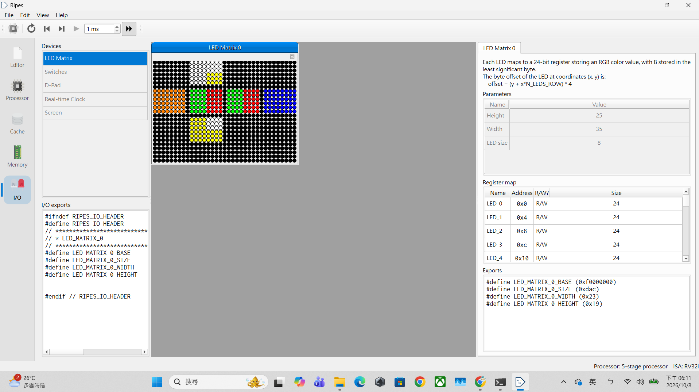

**Step 1 — after `R`.**


**Step 2 — after `B'`.**

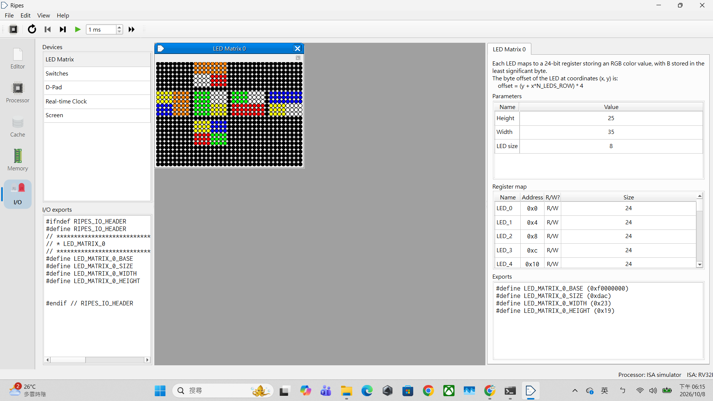

**Step 3 — after `D2`.**

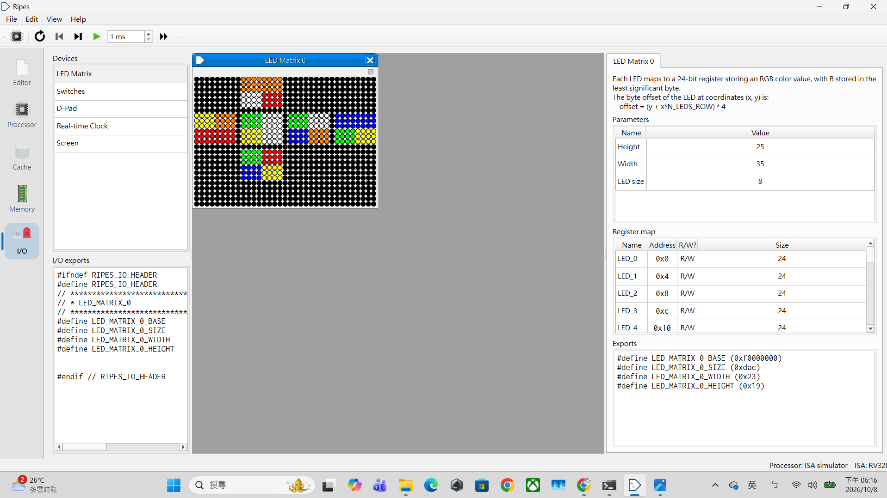

**Step 4 — after `R'`.**


**Step 5 — after `B`.**


**Step 6 — after `R'`.**


**Step 7 — after `B'`.**


**Step 8 — after `R`.**

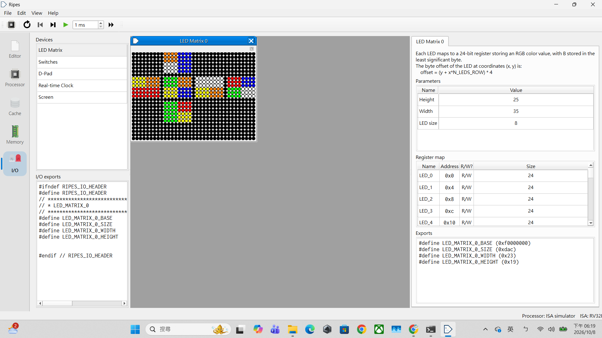

**Step 9 — after `D2`.**

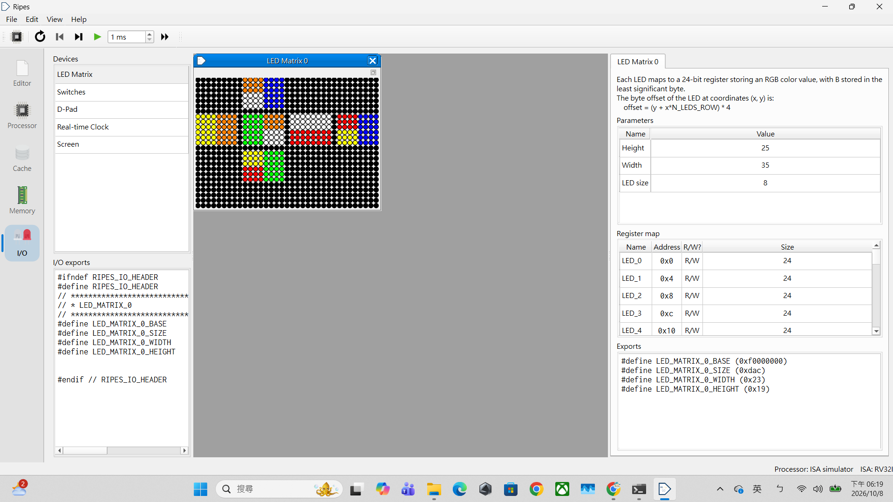

**Step 10 — after `R`.**

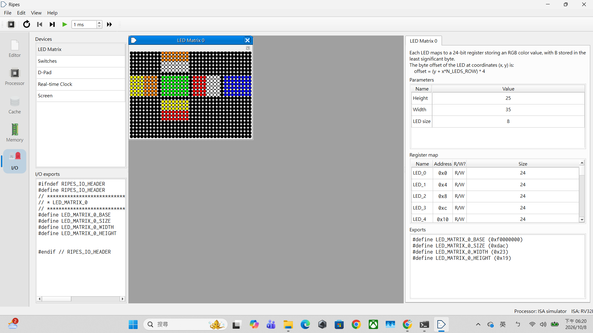

**Step 11 — after `B`; all six faces are solved.**

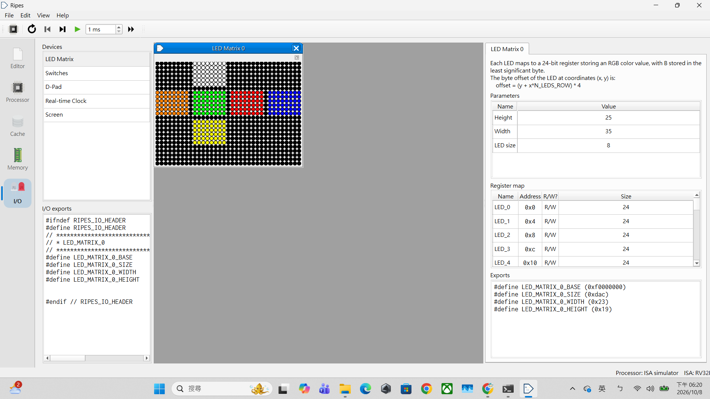

### 4.8 Pipeline Walkthrough

The screenshots below were captured before the inline-input revision. They document that captured build; adding the parser changes instruction addresses, so the displayed PCs are not asserted for the current build.

The captured `RV32_5S` trace follows `lhu t1,0(t0)` at instruction address **0x1c0**.

| Stage | Recorded cycle |
|---|---:|
| IF | 109 |
| ID | 110 |
| EX | 111 |
| MEM | 112 |
| WB | 113 |
| After the WB clock edge | 114 |

The load's data address was `0x10000012` and the loaded halfword was `0x04cb`. `t1/x6` still showed `0x00000009` at MEM and in the pre-edge WB snapshot; the following clock updated it to `0x000004cb`.

The screenshots below use the newly supplied `EX(2).png` for EX and `write success(1).png` for the register update after WB. They document this captured build; instruction and data addresses may change in a different build.

#### Load Instruction: IF to WB

**IF, cycle 109.** The instruction at `0x1c0` is in instruction fetch.

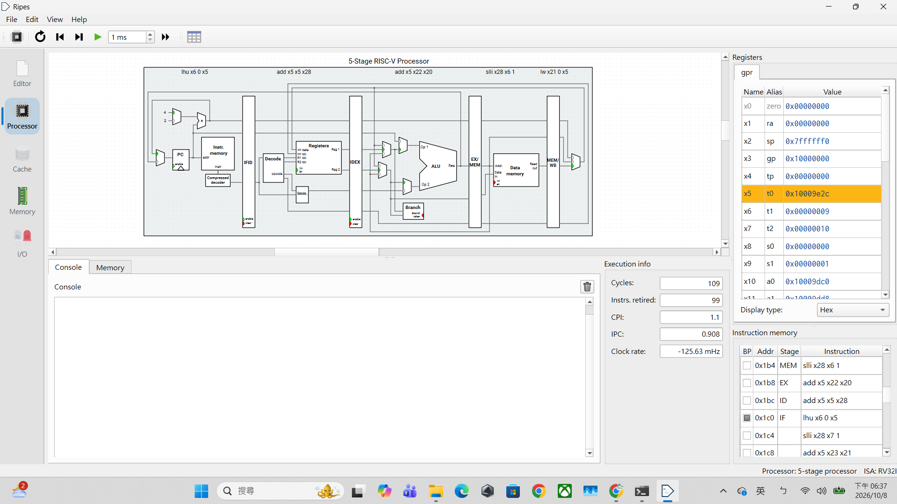

**ID, cycle 110.** The same instruction is in decode.


**EX, cycle 111.** The instruction is in execute, where the effective address is calculated.

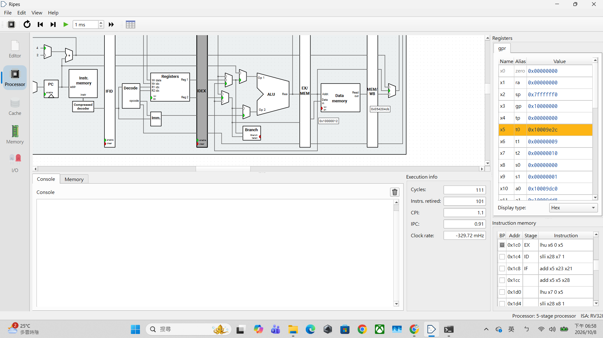

**MEM, cycle 112.** Memory is read at `0x10000012`; the read value is `0x000004cb`, while `t1/x6` still contains `0x00000009`.

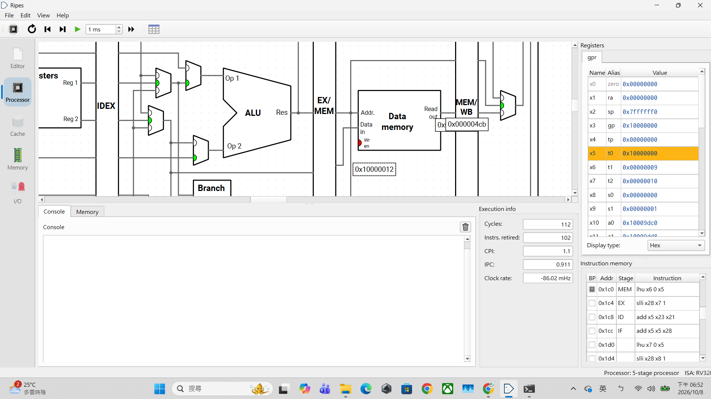

**WB, cycle 113.** The load is in writeback. This pre-edge snapshot still shows `t1/x6 = 0x00000009`.

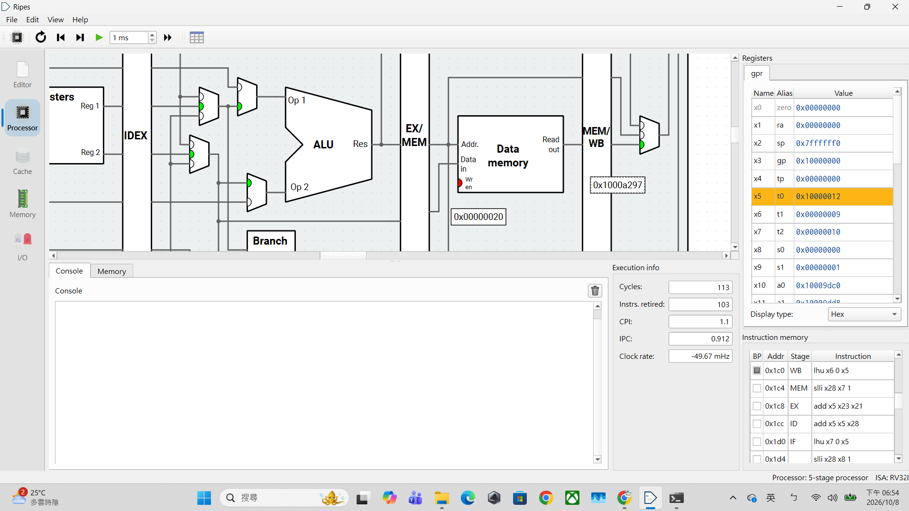

**After WB, cycle 114.** After the next clock edge, `t1/x6` contains `0x000004cb`.

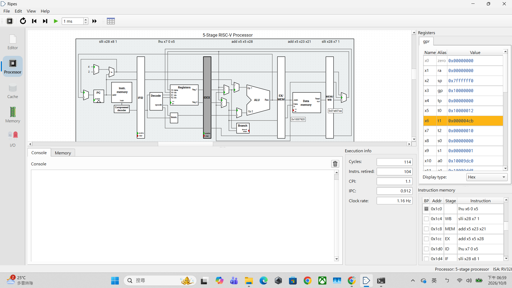

#### Store Instruction and Memory Update

The store `sh t1,0(t0)` at instruction address **0x1dc** was captured in MEM at cycle 119, with destination `0x10009df0`, data input `0x000004cb`, and memory write enable asserted.

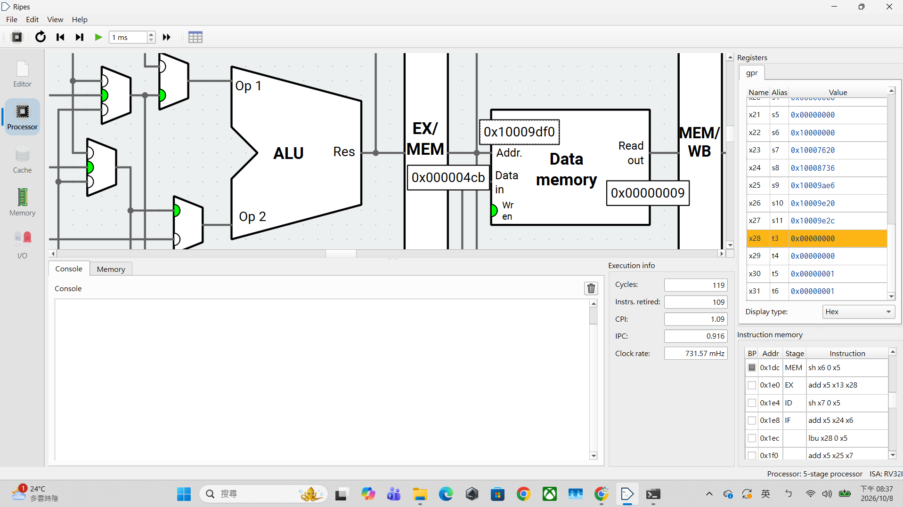

At cycle 120, the store is in WB and the memory view at `0x10009df0` contains bytes **`cb 04`**, matching the stored halfword `0x04cb` in little-endian order. The data-memory signals at this later cycle belong to the next instruction.

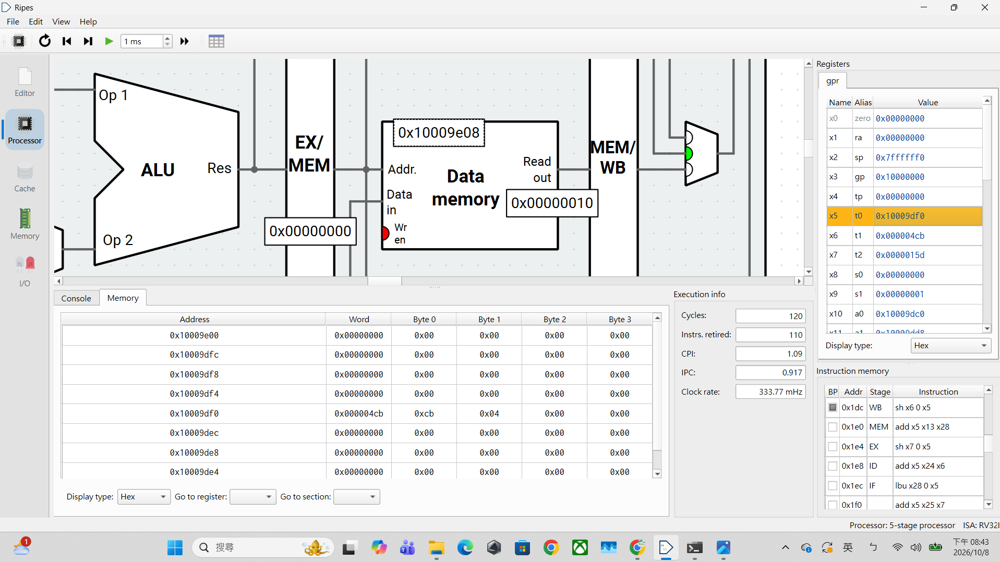

**TODO — student-written instruction analysis:** Explain IF/ID/EX/MEM/WB for the selected load and store, the register-write-enable and writeback-multiplexer signals, and why the memory bytes are correct. Use the attached screenshots to support the explanation. Distinguish an instruction address from a data address, and distinguish a stage snapshot from the clock edge that commits its result.

## Development Evidence and AI Assistance

ChatGPT/Codex provided substantial assistance with concepts, C search and verification fragments, assembly and renderer fragments, debugging and optimization, recovery of a working assembly source, test/audit/comparison scripts, and report organization and English editing.

The Windows measurement outputs reported here were supplied from my local runs. I also carried out the reported Ripes LED demonstration and pipeline stepping. Supporting assistant-side checks are not presented as my Ripes measurements.

**TODO — student-written contribution and reflection:** State the decisions or analysis you made independently, the suggestions you accepted, rejected, or changed, and the difficulties you resolved. Identify actual commits and at least three substantive report revisions, or explain thin history and provide equivalent development evidence. Do not invent a revision history or describe AI-generated assembly as independently authored.

The assignment explicitly reserves representation/search design, admissibility reasoning, reported measurements, optimization reasoning, RV32I assembly, and report analysis for the student. Disclosure does not establish compliance with that independent-work requirement. This draft records the assistance actually received.

## Remaining Report and Submission Checks

- [ ] Confirm machine/compiler attribution and the memory unit.
- [ ] Complete the student-written mathematical, design, optimization, comparison, LED, and pipeline analysis.
- [x] Implement and test the inlined 14-character assembly input interface on the target.
- [x] Record solved/short/distance-11 production tests on both required processor models: 3/3 on each, with zero length or replay failures.
- [x] Record the new reference vector's production ISS instruction count: 17,683,806, from the required-case report.
- [x] Attach the LED animation and load/store pipeline screenshots.
- [ ] Add revision-pinned source/test-evidence links.
- [ ] Check the final source against the tested manifests; distinguish earlier evidence from any new revision.
- [ ] Push the submission source and evidence, tag the submission commit, and record the tag.
- [ ] Publish HackMD, enable editing by signed-in users, and record the report revision URL.
- [ ] Submit the fork and report through the assignment form and retain the acceptance email.

Phase 2 is a separate interview due on October 18. Completing the tested quantitative gates does not submit Phase 1 or complete Phase 2.

## References

- [Assignment 1 specification](https://hackmd.io/@sysprog/2026-arch-homework1).
- [Course AI guidelines](https://hackmd.io/@sysprog/arch2026-ai-guidelines).
- [Upstream minirubik](https://github.com/sysprog21/minirubik).
- [Ripes documentation](https://github.com/mortbopet/Ripes/tree/master/docs).
- The retained native validation logs, Ripes reports, comparison results, final audit, and original screenshots described above.
